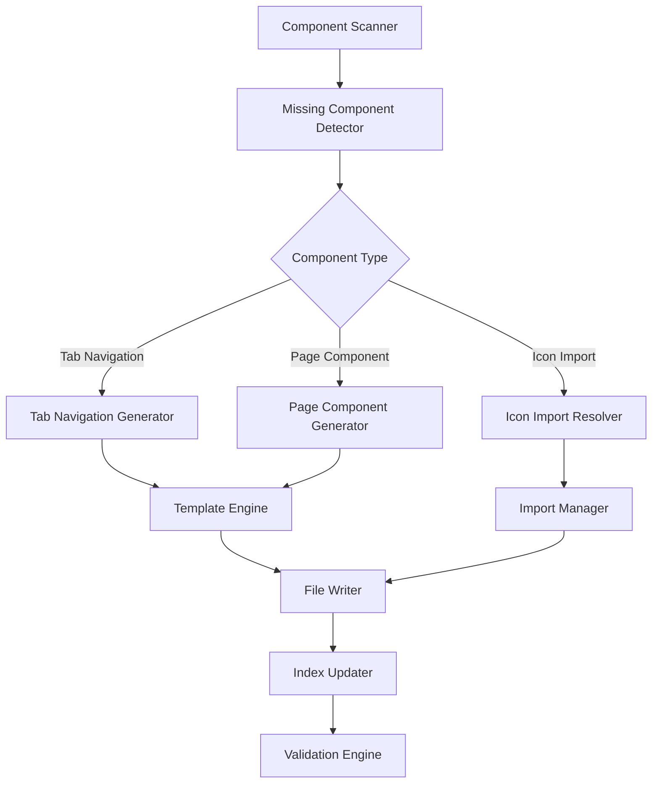

# Design Document

## Overview

누락된 UI 컴포넌트들 자동 생성 시스템은 현재 Primes 앱에서 발생하는 1100+ 빌드 에러를 해결하기 위한 자동화 도구입니다. 이 시스템은 Tab Navigation 컴포넌트, 아이콘 import, 페이지 컴포넌트를 자동으로 감지하고 생성하여 개발 효율성을 높이고 일관성을 보장합니다.

## Architecture

### 시스템 구성도



### 핵심 모듈

1. **Component Scanner**: 프로젝트 전체를 스캔하여 누락된 컴포넌트 식별
2. **Template Engine**: 표준화된 템플릿을 사용하여 컴포넌트 생성
3. **Import Manager**: 누락된 import 구문 자동 해결
4. **Validation Engine**: 생성된 컴포넌트의 정합성 검증

## Components and Interfaces

### 1. Component Scanner

```typescript
interface ComponentScanner {
  scanMissingTabNavigations(): Promise<MissingTabNavigation[]>;
  scanMissingIcons(): Promise<MissingIcon[]>;
  scanMissingPages(): Promise<MissingPage[]>;
  scanAll(): Promise<MissingComponents>;
}

interface MissingTabNavigation {
  solution: string;
  entity: string;
  expectedName: string;
  referencedIn: string[];
  hasDetail: boolean;
}

interface MissingIcon {
  iconName: string;
  filePath: string;
  lineNumber: number;
  suggestedLibrary: string;
}

interface MissingPage {
  pageName: string;
  pageType: 'List' | 'Register' | 'MasterDetail';
  solution: string;
  entity: string;
  referencedIn: string[];
}
```

### 2. Tab Navigation Generator

```typescript
interface TabNavigationGenerator {
  generateTabNavigation(config: TabNavigationConfig): Promise<string>;
  getTabNavigationTemplate(hasDetail: boolean): string;
  updateTabsIndex(newComponents: string[]): Promise<void>;
}

interface TabNavigationConfig {
  solution: string;
  entity: string;
  hasDetail: boolean;
  customTabs?: TabConfig[];
}

interface TabConfig {
  id: string;
  icon: string;
  label: string;
  pageType: 'List' | 'MasterDetail';
}
```

### 3. Icon Import Resolver

```typescript
interface IconImportResolver {
  resolveIconImports(filePath: string): Promise<void>;
  getIconMapping(iconName: string): IconMapping | null;
  addIconImport(filePath: string, icons: string[], library: string): Promise<void>;
}

interface IconMapping {
  iconName: string;
  library: 'lucide-react' | '@fortawesome/react-fontawesome' | 'react-icons';
  importName: string;
}
```

### 4. Page Component Generator

```typescript
interface PageComponentGenerator {
  generateListPage(config: PageConfig): Promise<string>;
  generateRegisterPage(config: PageConfig): Promise<string>;
  generateMasterDetailPage(config: PageConfig): Promise<string>;
}

interface PageConfig {
  solution: string;
  entity: string;
  pageType: 'List' | 'Register' | 'MasterDetail';
  hookName: string;
  outputPath: string;
}
```

## Data Models

### Template Data Models

```typescript
interface TabNavigationTemplate {
  solution: string;
  entity: string;
  entityCapitalized: string;
  entityKebab: string;
  hasDetail: boolean;
  tabs: TabDefinition[];
  imports: ImportStatement[];
}

interface TabDefinition {
  id: string;
  icon: string;
  label: string;
  route: string;
  component: string;
}

interface PageTemplate {
  solution: string;
  entity: string;
  entityCapitalized: string;
  pageType: string;
  hookImport: string;
  hookUsage: string;
  componentName: string;
}
```

### Configuration Models

```typescript
interface GeneratorConfig {
  solutions: SolutionConfig[];
  iconMappings: IconMapping[];
  templatePaths: TemplatePaths;
  outputPaths: OutputPaths;
}

interface SolutionConfig {
  name: string;
  entities: EntityConfig[];
  basePath: string;
}

interface EntityConfig {
  name: string;
  hasDetail: boolean;
  customLabels?: Record<string, string>;
}
```

## Error Handling

### Error Types

```typescript
enum GeneratorErrorType {
  TEMPLATE_NOT_FOUND = 'TEMPLATE_NOT_FOUND',
  FILE_WRITE_ERROR = 'FILE_WRITE_ERROR',
  IMPORT_RESOLUTION_ERROR = 'IMPORT_RESOLUTION_ERROR',
  VALIDATION_ERROR = 'VALIDATION_ERROR',
  DEPENDENCY_ERROR = 'DEPENDENCY_ERROR'
}

interface GeneratorError {
  type: GeneratorErrorType;
  message: string;
  filePath?: string;
  suggestions?: string[];
}
```

### Error Recovery Strategies

1. **Template Fallback**: 기본 템플릿으로 대체
2. **Partial Generation**: 일부 컴포넌트만 생성하고 계속 진행
3. **Manual Intervention**: 사용자 입력 요청
4. **Rollback**: 실패 시 이전 상태로 복원

## Testing Strategy

### Unit Testing

```typescript
describe('ComponentScanner', () => {
  test('should detect missing tab navigations', async () => {
    const scanner = new ComponentScanner();
    const missing = await scanner.scanMissingTabNavigations();
    expect(missing).toContainEqual({
      solution: 'sales',
      entity: 'taxInvoice',
      expectedName: 'TaxInvoiceTabNavigation',
      hasDetail: true
    });
  });
});

describe('TabNavigationGenerator', () => {
  test('should generate tab navigation with correct structure', async () => {
    const generator = new TabNavigationGenerator();
    const result = await generator.generateTabNavigation({
      solution: 'sales',
      entity: 'estimate',
      hasDetail: true
    });
    expect(result).toContain('EstimateTabNavigation');
    expect(result).toContain('MasterDetailPage');
  });
});
```

### Integration Testing

```typescript
describe('End-to-End Generation', () => {
  test('should resolve all missing components for sales solution', async () => {
    const system = new MissingComponentsGenerator();
    const result = await system.generateAll(['sales']);
    
    expect(result.tabNavigations).toHaveLength(6);
    expect(result.pages).toHaveLength(18);
    expect(result.iconImports).toBeGreaterThan(0);
  });
});
```

### Validation Testing

```typescript
describe('Generated Component Validation', () => {
  test('generated tab navigation should compile without errors', async () => {
    const generator = new TabNavigationGenerator();
    const component = await generator.generateTabNavigation(config);
    
    const validation = await validateTypeScript(component);
    expect(validation.errors).toHaveLength(0);
  });
});
```

## Implementation Details

### Template System

#### Tab Navigation Templates

**Single Page Template** (`templates/tab-navigation-single.tsx.template`):
```typescript
import React, { useState, useEffect } from 'react';
import TabLayout from '@primes/layouts/TabLayout';
import { TabItem } from '@primes/templates/TabTemplate';
import { RadixIconButton } from '@radix-ui/components';
import { Plus, {{ICON_IMPORTS}} } from 'lucide-react';
import { useLocation } from 'react-router-dom';
import { DraggableDialog } from '@repo/radix-ui/components';

interface TabNavigationProps {
	activetab?: string;
}

const {{COMPONENT_NAME}}: React.FC<TabNavigationProps> = ({ activetab }) => {
	const [currentTab, setCurrentTab] = useState<string>(activetab || 'list');
	const [openModal, setOpenModal] = useState<boolean>(false);
	const location = useLocation();

	const tabs: TabItem[] = [
		{
			id: 'list',
			icon: <{{LIST_ICON}} size={16} />,
			label: '현황',
			to: '/{{SOLUTION_KEBAB}}/{{ENTITY_KEBAB}}/list',
			content: <{{LIST_PAGE_COMPONENT}} />,
		}
	];

	return (
		<>
			<DraggableDialog
				open={openModal}
				onOpenChange={setOpenModal}
				title="{{ENTITY_LABEL}} 등록"
				content={<{{REGISTER_PAGE_COMPONENT}} onClose={() => setOpenModal(false)} />}
			/>
			<TabLayout
				title="{{ENTITY_LABEL}} 관리"
				tabs={tabs}
				defaultValue={currentTab}
				buttonSlot={<RegisterButton />}
				onValueChange={setCurrentTab}
			/>
		</>
	);
};

export default {{COMPONENT_NAME}};
```

**Master-Detail Template** (`templates/tab-navigation-master-detail.tsx.template`):
```typescript
const tabs: TabItem[] = [
	{
		id: 'related-list',
		icon: <Table size={16} />,
		label: '상세 목록',
		to: '/{{SOLUTION_KEBAB}}/{{ENTITY_KEBAB}}/related-list',
		content: <{{MASTER_DETAIL_PAGE_COMPONENT}} />,
	},
	{
		id: 'list',
		icon: <FileText size={16} />,
		label: '전체 현황',
		to: '/{{SOLUTION_KEBAB}}/{{ENTITY_KEBAB}}/list',
		content: <{{LIST_PAGE_COMPONENT}} />,
	}
];
```

#### Page Component Templates

**List Page Template** (`templates/list-page.tsx.template`):
```typescript
import React, { useState } from 'react';
import { {{HOOK_NAME}} } from '@primes/hooks';

const {{COMPONENT_NAME}}: React.FC = () => {
	const [page, setPage] = useState(0);
	const [size, setSize] = useState(30);
	const [searchRequest, setSearchRequest] = useState({});

	const { data: apiData, isLoading, error } = {{HOOK_NAME}}({ 
		searchRequest, 
		page, 
		size 
	});

	if (isLoading) return <div>Loading...</div>;
	if (error) return <div>Error: {error.message}</div>;

	return (
		<div className="p-4">
			<h1>{{ENTITY_LABEL}} 목록</h1>
			{/* 테이블 컴포넌트 */}
		</div>
	);
};

export default {{COMPONENT_NAME}};
```

### Icon Mapping System

```typescript
const ICON_MAPPINGS: Record<string, IconMapping> = {
  'TableProperties': {
    iconName: 'TableProperties',
    library: 'lucide-react',
    importName: 'TableProperties'
  },
  'Table': {
    iconName: 'Table',
    library: 'lucide-react', 
    importName: 'Table'
  },
  'FileText': {
    iconName: 'FileText',
    library: 'lucide-react',
    importName: 'FileText'
  },
  'Plus': {
    iconName: 'Plus',
    library: 'lucide-react',
    importName: 'Plus'
  }
};
```

### File Generation Strategy

1. **Dependency Order**: 페이지 컴포넌트 → Tab Navigation → Index 업데이트
2. **Atomic Operations**: 각 파일 생성을 독립적으로 처리
3. **Rollback Support**: 실패 시 생성된 파일들 정리
4. **Incremental Updates**: 기존 파일 보존하며 추가만 수행

### Performance Considerations

- **Parallel Processing**: 독립적인 컴포넌트들을 병렬로 생성
- **Template Caching**: 템플릿 파일들을 메모리에 캐시
- **Incremental Scanning**: 변경된 파일들만 스캔
- **Batch Operations**: 여러 파일 작업을 배치로 처리