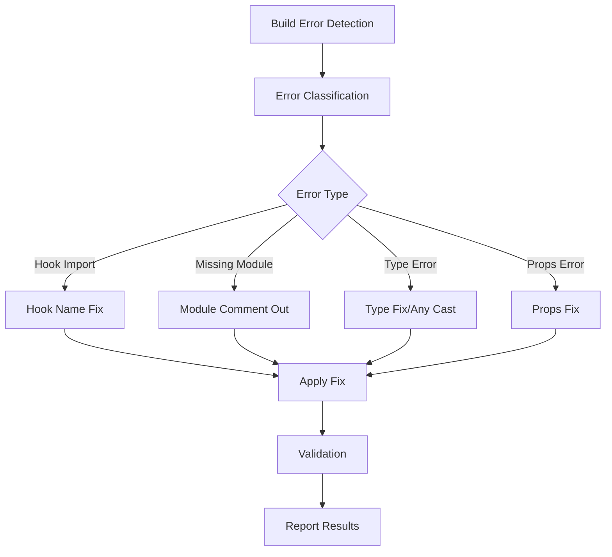

# Design Document

## Overview

Primes 앱의 빌드 에러를 자동으로 해결하는 시스템을 설계합니다. 현재 164개의 에러가 발생하고 있으며, 주요 에러 유형은 다음과 같습니다:

1. **Hook Import 에러**: Hook 이름 불일치 (PascalCase vs camelCase)
2. **Missing Module 에러**: 존재하지 않는 파일 import
3. **TypeScript 타입 에러**: Props 타입 불일치, Set<string>을 배열처럼 사용
4. **FormField 타입 에러**: placeholder 타입 불일치 (number vs string)

## Architecture

### 에러 분석 및 해결 시스템



### 에러 분류 시스템

1. **Hook Import 에러**
   - 패턴: `has no exported member named 'useXxx'. Did you mean 'usexxx'?`
   - 해결: import 문의 Hook 이름을 제안된 이름으로 수정

2. **Missing Module 에러**
   - 패턴: `Cannot find module 'xxx' or its corresponding type declarations`
   - 해결: import 문을 주석 처리하고 사용 부분도 주석 처리

3. **Set<string> 타입 에러**
   - 패턴: `Property 'length' does not exist on type 'Set<string>'`
   - 해결: `selectedRows.length`를 `selectedRows.size`로 변경하거나 Array.from() 사용

4. **FormField Props 에러**
   - 패턴: `placeholder: number; required: boolean` vs `placeholder: string`
   - 해결: number 타입 placeholder를 string으로 변환

## Components and Interfaces

### 1. Error Detector

```typescript
interface BuildError {
  file: string;
  line: number;
  column: number;
  type: ErrorType;
  message: string;
  suggestion?: string;
}

enum ErrorType {
  HOOK_IMPORT = 'hook_import',
  MISSING_MODULE = 'missing_module',
  TYPE_ERROR = 'type_error',
  PROPS_ERROR = 'props_error'
}

class ErrorDetector {
  parseBuildOutput(output: string): BuildError[]
  classifyError(error: BuildError): ErrorType
}
```

### 2. Error Fixers

```typescript
interface ErrorFixer {
  canFix(error: BuildError): boolean;
  fix(error: BuildError, fileContent: string): string;
}

class HookImportFixer implements ErrorFixer {
  // Hook import 이름 수정
}

class MissingModuleFixer implements ErrorFixer {
  // 존재하지 않는 모듈 import 주석 처리
}

class TypeErrorFixer implements ErrorFixer {
  // 타입 에러 any로 임시 해결
}

class PropsFixer implements ErrorFixer {
  // Props 타입 불일치 해결
}
```

### 3. File Processor

```typescript
class FileProcessor {
  processFile(filePath: string, errors: BuildError[]): ProcessResult
  backupOriginal(filePath: string): void
  applyFixes(filePath: string, fixes: Fix[]): void
}

interface ProcessResult {
  filePath: string;
  fixesApplied: Fix[];
  success: boolean;
  errors?: string[];
}
```

## Data Models

### Error Pattern Definitions

```typescript
const ERROR_PATTERNS = {
  HOOK_IMPORT: /has no exported member named '(\w+)'\. Did you mean '(\w+)'\?/,
  MISSING_MODULE: /Cannot find module '([^']+)' or its corresponding type declarations/,
  SET_LENGTH: /Property 'length' does not exist on type 'Set<string>'/,
  SET_INDEX: /Element implicitly has an 'any' type because expression of type '\d+' can't be used to index type 'Set<string>'/,
  PLACEHOLDER_TYPE: /Types of property 'placeholder' are incompatible\.\s*Type 'number' is not assignable to type 'string'/,
  FORM_FIELD_TYPE: /is not assignable to type 'FormField\[\]'/
};
```

### Fix Templates

```typescript
const FIX_TEMPLATES = {
  HOOK_IMPORT: (wrongName: string, correctName: string) => 
    `// Fixed: ${wrongName} -> ${correctName}`,
  
  MISSING_MODULE: (modulePath: string) => 
    `// Commented out missing module: ${modulePath}`,
    
  SET_TO_ARRAY: (setVar: string) => 
    `Array.from(${setVar})`,
    
  PLACEHOLDER_TO_STRING: (value: string) => 
    `String(${value})`
};
```

## Error Handling

### 에러 처리 전략

1. **파일 백업**: 수정 전 원본 파일 백업
2. **점진적 수정**: 한 번에 하나의 에러 타입씩 처리
3. **검증**: 수정 후 구문 분석으로 유효성 검증
4. **롤백**: 실패 시 원본으로 복원

### 안전장치

```typescript
class SafetyManager {
  createBackup(filePath: string): string
  validateSyntax(filePath: string): boolean
  rollback(filePath: string, backupPath: string): void
  cleanupBackups(): void
}
```

## Testing Strategy

### 테스트 접근법

1. **단위 테스트**: 각 Fixer 클래스별 테스트
2. **통합 테스트**: 전체 에러 해결 프로세스 테스트
3. **회귀 테스트**: 수정 후 빌드 성공 여부 확인

### 테스트 케이스

```typescript
describe('ErrorFixers', () => {
  describe('HookImportFixer', () => {
    it('should fix hook import name mismatch')
    it('should preserve original import in comment')
  })
  
  describe('MissingModuleFixer', () => {
    it('should comment out missing module imports')
    it('should comment out usage of missing modules')
  })
  
  describe('TypeErrorFixer', () => {
    it('should convert Set operations to Array operations')
    it('should cast types to any when needed')
  })
})
```

### 실제 에러 케이스 기반 테스트

현재 발견된 주요 에러들을 기반으로 테스트 케이스 작성:

1. **Hook 이름 불일치**: `useMoldOrder` vs `useMoldorder`
2. **Missing 페이지**: `PurchaseMasterListPage` 등
3. **Set<string> 사용**: `selectedRows.length`, `selectedRows[0]`
4. **FormField Props**: `placeholder: number` vs `placeholder: string`

## Implementation Notes

### 우선순위

1. **High Priority**: Hook import 에러 (가장 많은 에러)
2. **Medium Priority**: Missing module 에러
3. **Low Priority**: 타입 에러 (any로 임시 해결)

### 제약사항

- API가 준비되지 않은 상황이므로 Hook 사용 부분은 주석 처리
- 원본 코드는 주석으로 보존하여 나중에 복원 가능하도록 함
- 빌드 성공이 최우선 목표, 완벽한 타입 안전성은 나중에 고려