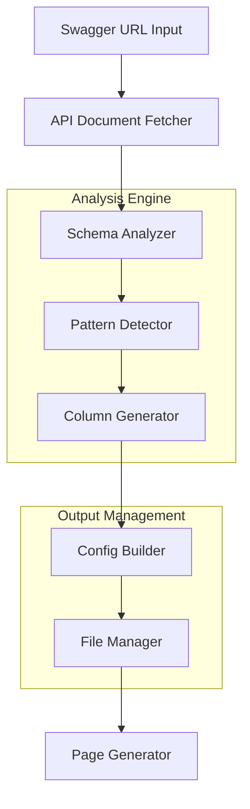

# Design Document

## Overview

Swagger API 문서를 분석하여 Primes 메타데이터 config를 자동 생성하는 시스템입니다. 각 솔루션별 API 구조를 분석하여 master-detail 패턴을 감지하고, 실제 필드 정보를 추출하여 정확한 컬럼 정의를 생성합니다.

## Architecture

### System Components



### Data Flow

1. **Input Phase**: Swagger API URL 수집
2. **Analysis Phase**: API 문서 분석 및 패턴 감지
3. **Generation Phase**: Config 메타데이터 생성
4. **Output Phase**: 솔루션별 config 파일 생성 및 페이지 생성

## Components and Interfaces

### 1. SwaggerAnalyzer

```typescript
interface SwaggerAnalyzer {
  fetchApiDoc(url: string): Promise<OpenAPIDocument>
  extractEntities(doc: OpenAPIDocument): Entity[]
  detectMasterDetailPattern(entity: Entity): PageType
  extractFieldInfo(schema: Schema): FieldInfo[]
  extractSearchFields(searchSchema: Schema): SearchFieldInfo[]
}

interface Entity {
  name: string
  endpoints: Endpoint[]
  schemas: Schema[]
  hasDetailEndpoint: boolean
  searchSchema?: Schema  // SearchRequest 스키마
}

interface SearchFieldInfo {
  name: string
  type: string
  label: string
  component: 'input' | 'select' | 'date' | 'dateRange'
  options?: Array<{label: string, value: string}>
}

interface FieldInfo {
  name: string
  type: string
  description: string
  example: any
  required: boolean
  maxLength?: number
}
```

### 2. ConfigGenerator

```typescript
interface ConfigGenerator {
  generateSolutionConfig(solution: string, entities: Entity[]): SolutionConfig
  createColumns(fields: FieldInfo[]): Column[]
  createFormFields(fields: FieldInfo[]): FormField[]
  createSearchSlotFields(searchFields: SearchFieldInfo[]): SearchSlotField[]
  generateTabs(entity: Entity): TabConfig[]
  determineTabPattern(entity: Entity): TabPattern
}

interface SearchSlotField {
  name: string
  label: string
  type: 'text' | 'select' | 'date' | 'dateRange'
  placeholder?: string
  options?: Array<{label: string, value: string}>
}

interface SolutionConfig {
  modules: Record<string, ModuleConfig>
}

interface ModuleConfig {
  name: string
  path: string
  route: string
  tabs: TabConfig[]
  actions: ActionConfig[]
  menuOptions: MenuOptions
}
```

### 3. FileManager

```typescript
interface FileManager {
  saveSolutionConfig(solution: string, config: SolutionConfig): void
  loadAllConfigs(): Record<string, SolutionConfig>
  mergeConfigs(configs: Record<string, SolutionConfig>): MainConfig
  backupExistingConfig(): void
}
```


## Tab Generation Logic

### Tab Patterns

#### Single Page Pattern
```typescript
const SINGLE_PAGE_TABS: TabTemplate[] = [
  {
    id: 'list',
    name: '현황',
    type: 'singlePage',
    icon: 'TableProperties',
    isDefault: true
  }
  // 추후 추가 탭들이 여기에 포함될 예정
]
```

#### Master-Detail Pattern
```typescript
const MASTER_DETAIL_TABS: TabTemplate[] = [
  {
    id: 'related-list',
    name: '상세 목록',
    type: 'masterDetailPage',
    icon: 'Table',
    isDefault: true
  },
  {
    id: 'list',
    name: '전체 현황',
    type: 'singlePage',
    icon: 'FileText',
    isDefault: false
  },
  {
    id: 'analyze',
    name: '분석',
    type: 'singlePage',
    icon: 'ChartPie',
    isDefault: false,
    isAnalyze: true  // 분석 페이지 템플릿 (준비 중)
  }
]
```

### Search Field Generation

#### Search API Pattern Detection
```typescript
interface SearchAnalyzer {
  detectSearchEndpoint(entity: Entity): Endpoint | null
  extractSearchRequestSchema(endpoint: Endpoint): Schema | null
  generateSearchSlotFields(searchSchema: Schema): SearchSlotField[]
}

class SearchAnalyzerImpl implements SearchAnalyzer {
  detectSearchEndpoint(entity: Entity): Endpoint | null {
    // 1. {entity}/master 엔드포인트의 GET 메서드에서 searchRequest 파라미터 확인
    // 2. searchRequest 스키마 추출
    // 3. UI 컴포넌트 타입 결정
    
    const masterEndpoint = entity.endpoints.find(ep => 
      ep.path.includes('/master') && ep.method === 'GET'
    )
    
    if (masterEndpoint?.parameters) {
      const searchParam = masterEndpoint.parameters.find(p => 
        p.name === 'searchRequest'
      )
      return searchParam ? masterEndpoint : null
    }
    
    return null
  }
  
  generateSearchSlotFields(searchSchema: Schema): SearchSlotField[] {
    const fields: SearchSlotField[] = []
    
    Object.entries(searchSchema.properties || {}).forEach(([key, prop]) => {
      // 백엔드 팀의 통합 작업을 고려하여 UI 우선 생성
      const field: SearchSlotField = {
        name: key,
        label: this.generateLabel(key),
        type: this.determineSearchFieldType(prop),
        placeholder: this.generatePlaceholder(key, prop)
      }
      
      if (prop.enum) {
        field.options = prop.enum.map(value => ({
          label: value,
          value: value
        }))
      }
      
      fields.push(field)
    })
    
    return fields
  }
}
```

### Tab Generation Rules

```typescript
interface TabGenerator {
  generateTabsForEntity(entity: Entity): TabConfig[]
  createAnalyzeTab(entity: Entity): TabConfig | null
  isAnalyzeTabSupported(): boolean  // 분석 템플릿 준비 상태 확인
}

class TabGeneratorImpl implements TabGenerator {
  generateTabsForEntity(entity: Entity): TabConfig[] {
    const pattern = this.determineTabPattern(entity)
    
    switch (pattern) {
      case TabPattern.SINGLE_STATUS:
        return this.generateSinglePageTabs(entity)
      
      case TabPattern.MASTER_DETAIL_FULL:
        return this.generateMasterDetailTabs(entity)
      
      default:
        return this.generateDefaultTabs(entity)
    }
  }
  
  private generateMasterDetailTabs(entity: Entity): TabConfig[] {
    const tabs = [
      this.createRelatedListTab(entity),
      this.createListTab(entity)
    ]
    
    // 분석 탭은 템플릿이 준비되면 추가
    if (this.isAnalyzeTabSupported()) {
      tabs.push(this.createAnalyzeTab(entity))
    }
    
    return tabs
  }
}
```

## Data Models

### OpenAPI Document Structure

```typescript
interface OpenAPIDocument {
  openapi: string
  info: Info
  paths: Record<string, PathItem>
  components: {
    schemas: Record<string, Schema>
  }
}

interface PathItem {
  get?: Operation
  post?: Operation
  put?: Operation
  delete?: Operation
}

interface Operation {
  tags: string[]
  summary: string
  operationId: string
  parameters?: Parameter[]
  requestBody?: RequestBody
  responses: Record<string, Response>
}
```

### Generated Config Structure

```typescript
interface Column {
  accessorKey: string
  header: string
  size: number
  minSize?: number
}

interface FormField {
  name: string
  label: string
  type: 'text' | 'email' | 'date' | 'select' | 'number' | 'textarea'
  placeholder?: string
  required?: boolean
  options?: Array<{label: string, value: string}>
  mask?: string
  pattern?: RegExp
}

interface TabConfig {
  id: string
  name: string
  type: 'singlePage' | 'masterDetailPage'
  path: string
  pageName: string
  icon: string
  default: boolean
  columns?: Column[]
  masterColumns?: Column[]
  detailColumns?: Column[]
  tableControl: TableControl
  searchOptions: SearchOptions
  searchSlotFields?: SearchSlotField[]  // SearchSlotComponent용 필드 정의
  dataHook: string
  masterDataHook?: string
  detailDataHook?: string
}

// Tab Configuration Patterns
enum TabPattern {
  SINGLE_STATUS = 'single-status',           // Single page: 현황 탭만
  MASTER_DETAIL_FULL = 'master-detail-full'  // Master-Detail: related-list, list, analyze 탭
}

interface TabGenerationRule {
  pattern: TabPattern
  tabs: TabTemplate[]
}

interface TabTemplate {
  id: string
  name: string
  type: 'singlePage' | 'masterDetailPage'
  icon: string
  isDefault: boolean
  isAnalyze?: boolean  // 분석 페이지 여부
}
```

## Error Handling

### Error Types

1. **Network Errors**: API 문서 fetch 실패
2. **Parse Errors**: Swagger 문서 파싱 오류
3. **Schema Errors**: 스키마 구조 불일치
4. **File System Errors**: Config 파일 저장 실패

### Error Recovery Strategy

```typescript
interface ErrorHandler {
  handleNetworkError(error: NetworkError): RecoveryAction
  handleParseError(error: ParseError): RecoveryAction
  handleSchemaError(error: SchemaError): RecoveryAction
  logError(error: Error, context: string): void
}

enum RecoveryAction {
  RETRY = 'retry',
  SKIP = 'skip',
  FALLBACK = 'fallback',
  ABORT = 'abort'
}
```

## Testing Strategy

### Unit Tests

1. **SwaggerAnalyzer Tests**
   - API 문서 파싱 테스트
   - 엔티티 추출 테스트
   - Master-Detail 패턴 감지 테스트

2. **ConfigGenerator Tests**
   - 컬럼 생성 테스트
   - 폼 필드 생성 테스트
   - 검색 필드 선택 테스트

3. **ErrorHandler Tests**
   - 오류 처리 테스트
   - 복구 전략 테스트
   - 로깅 기능 테스트

### Integration Tests

1. **End-to-End Workflow**
   - 전체 파이프라인 테스트
   - 실제 Swagger API 사용 테스트
   - 생성된 페이지 동작 테스트

2. **File System Integration**
   - Config 파일 저장/로드 테스트
   - 백업/복원 테스트
   - 병합 기능 테스트

### Test Data

```typescript
// Mock Swagger Document
const mockSwaggerDoc = {
  paths: {
    '/order/master': { get: {...}, post: {...} },
    '/order/detail': { get: {...}, post: {...} },
    '/estimate/master': { get: {...}, post: {...} }
  },
  components: {
    schemas: {
      OrderMasterDto: { properties: {...} },
      OrderDetailDto: { properties: {...} }
    }
  }
}
```

## Implementation Plan

### Phase 1: Core Analysis Engine
- SwaggerAnalyzer 구현
- 기본 패턴 감지 로직
- 필드 정보 추출

### Phase 2: Config Generation
- ConfigGenerator 구현
- 컬럼 및 폼 필드 생성
- 탭 패턴 감지 및 생성 로직
- 솔루션별 config 구조화

### Phase 3: File Management
- FileManager 구현
- 솔루션별 분리 저장
- Config 병합 기능

### Phase 4: Error Handling & Testing
- ErrorHandler 구현
- 오류 복구 전략
- 종합 테스트

### Phase 5: CLI Integration & Future Extensions
- 명령행 인터페이스
- 배치 처리 기능
- 자동화 스크립트
- 분석 페이지 템플릿 통합 준비 (PR 대기 중)