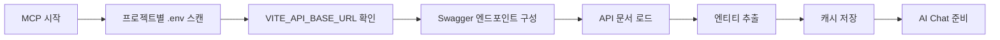

# 🔄 프로젝트별 .env 기반 동적 Swagger 시스템 가이드

## 🎯 **개요**

각 프로젝트별로 `.env` 파일의 `VITE_API_BASE_URL`을 기반으로 Swagger API를 자동 발견하고 반영하는 시스템입니다.

### **🚀 주요 장점**

1. **🔍 자동 발견**: 각 프로젝트의 .env 파일에서 API URL 자동 감지
2. **⚡ 실시간 반영**: .env 파일 변경 시 개발 서버 재시작으로 반영
3. **🌐 다중 프로젝트 지원**: 모든 프로젝트에서 동일한 방식으로 작동
4. **🛡️ 프로젝트별 독립성**: 각 프로젝트가 독립적인 API 서버 사용

## 🔧 **작동 원리**

### **1. 자동 발견 과정**



### **2. 발견 패턴**

#### **우선순위 1: 프로젝트별 .env 파일**

```
apps/{project}/.env
VITE_API_BASE_URL=http://localhost:8080/api
```

- 각 프로젝트 디렉토리에 .env 파일 존재
- VITE_API_BASE_URL 환경 변수로 API 기본 URL 설정

#### **우선순위 2: Swagger Config (가장 정확)**

```
GET {VITE_API_BASE_URL}/v3/api-docs/swagger-config
```

- 서버에서 제공하는 공식 설정
- 모든 사용 가능한 그룹/도메인 정보 포함

#### **우선순위 3: 기본 API Docs**

```
GET {VITE_API_BASE_URL}/v3/api-docs
```

- 단일 Swagger 문서
- 통합 API 구조

#### **우선순위 4: 도메인별 패턴**

```
GET {VITE_API_BASE_URL}/v3/api-docs/{domain}
```

- Primes: ini, sales, purchase, production, machine, mold, quality
- AIPS: ai, data, processing, analytics
- ESG: account, meter, report
- SCM: supply, inventory, logistics

## 🎯 **AI Chat 사용법**

### **기본 명령어**

```bash
# 1. 프로젝트별 Swagger 상태 확인
"Primes 프로젝트 Swagger 상태 알려줘"
"ESG 프로젝트 Swagger 상태 확인해줘"
"AIPS 프로젝트 Swagger 상태 알려줘"
"SCM 프로젝트 Swagger 상태 확인해줘"

# 2. 강제 새로고침 (새로운 API 추가 후)
"Primes Swagger 새로고침해줘"
"ESG API 다시 찾아줘"

# 3. 엔티티 목록 조회
"Primes 프로젝트 엔티티 목록 보여줘"
"ESG 프로젝트 엔티티 목록 보여줘"
"AIPS 프로젝트 엔티티 목록 보여줘"
"SCM 프로젝트 엔티티 목록 보여줘"

# 4. 특정 엔티티 분석
"Primes Machine 엔티티 분석해줘"
"ESG Meter 엔티티 분석해줘"

# 5. 페이지 생성
"Primes Machine 리스트 페이지 만들어줘"
"ESG CarbonEmission 대시보드 만들어줘"
```

### **고급 사용법**

```bash
# 프로젝트 간 참조
"ESG의 MeterPage 같은 구조로 Primes에 만들어줘"
"다른 프로젝트 패턴 참고해서 만들어줘"

# 특정 도메인 분석 (Multi-Swagger)
"machine 도메인 엔티티 보여줘"
"sales 도메인 분석해줘"

# 환경별 API 확인
"개발 환경 API 상태 확인해줘"
"로컬 환경 API 연결 상태 알려줘"
```

## 🏗️ **프로젝트별 구조**

### **Primes 프로젝트 (ERP 시스템)**

```bash
# apps/primes/.env
VITE_API_BASE_URL=http://localhost:8080/api

# Swagger 구조
http://localhost:8080/api/v3/api-docs              # 기본
http://localhost:8080/api/v3/api-docs/ini          # 초기화
http://localhost:8080/api/v3/api-docs/sales        # 영업
http://localhost:8080/api/v3/api-docs/purchase     # 구매
http://localhost:8080/api/v3/api-docs/production   # 생산
http://localhost:8080/api/v3/api-docs/machine      # 설비
http://localhost:8080/api/v3/api-docs/mold         # 금형
http://localhost:8080/api/v3/api-docs/quality      # 품질
```

### **ESG 프로젝트 (지속가능성 관리)**

```bash
# apps/esg/.env
VITE_API_BASE_URL=http://localhost:8081/api

# Swagger 구조
http://localhost:8081/api/v3/api-docs              # 기본
http://localhost:8081/api/v3/api-docs/account      # 계정
http://localhost:8081/api/v3/api-docs/meter        # 미터
http://localhost:8081/api/v3/api-docs/report       # 리포트
```

### **AIPS 프로젝트 (AI 생산성 시스템)**

```bash
# apps/aips/.env
VITE_API_BASE_URL=http://localhost:8082/api

# Swagger 구조
http://localhost:8082/api/v3/api-docs              # 기본
http://localhost:8082/api/v3/api-docs/ai           # AI 모듈
http://localhost:8082/api/v3/api-docs/data         # 데이터
http://localhost:8082/api/v3/api-docs/processing   # 처리
http://localhost:8082/api/v3/api-docs/analytics    # 분석
```

### **SCM 프로젝트 (공급망 관리)**

```bash
# apps/scm/.env
VITE_API_BASE_URL=http://localhost:8083/api

# Swagger 구조
http://localhost:8083/api/v3/api-docs              # 기본
http://localhost:8083/api/v3/api-docs/supply       # 공급
http://localhost:8083/api/v3/api-docs/inventory    # 재고
http://localhost:8083/api/v3/api-docs/logistics    # 물류
```

## 🔧 **설정 및 관리**

### **1. .env 파일 생성**

```bash
# 각 프로젝트에서 .env 파일 생성
cd apps/primes && echo "VITE_API_BASE_URL=http://localhost:8080/api" > .env
cd apps/esg && echo "VITE_API_BASE_URL=http://localhost:8081/api" > .env
cd apps/aips && echo "VITE_API_BASE_URL=http://localhost:8082/api" > .env
cd apps/scm && echo "VITE_API_BASE_URL=http://localhost:8083/api" > .env
```

### **2. .gitignore 설정**

```bash
# 각 프로젝트의 .gitignore에 .env 추가
echo ".env" >> apps/primes/.gitignore
echo ".env" >> apps/esg/.gitignore
echo ".env" >> apps/aips/.gitignore
echo ".env" >> apps/scm/.gitignore
```

### **3. 환경별 설정 분리**

```bash
# 개발 환경
VITE_API_BASE_URL=https://dev-api.{project}.company.com/api

# 스테이징 환경
VITE_API_BASE_URL=https://staging-api.{project}.company.com/api

# 프로덕션 환경
VITE_API_BASE_URL=https://api.{project}.company.com/api
```

## 🚀 **빠른 시작**

### **새 프로젝트 추가**

```bash
# 1. 프로젝트 디렉토리 생성
mkdir -p apps/new-project

# 2. .env 파일 생성
echo "VITE_API_BASE_URL=http://localhost:8084/api" > apps/new-project/.env

# 3. 개발 서버 시작
cd apps/new-project
pnpm dev

# 4. MCP에서 확인
"새 프로젝트 Swagger 상태 확인해줘"
```

### **기존 프로젝트 수정**

```bash
# 1. .env 파일 수정
echo "VITE_API_BASE_URL=http://localhost:8085/api" > apps/existing-project/.env

# 2. 개발 서버 재시작
cd apps/existing-project
pnpm dev

# 3. 변경사항 확인
"프로젝트 Swagger 상태 확인해줘"
```

## 🔍 **문제 해결**

### **일반적인 문제**

1. **API 연결 실패**
    - .env 파일의 VITE_API_BASE_URL 확인
    - 백엔드 서버 실행 상태 확인
    - 포트 번호 확인

2. **Swagger 문서 로드 실패**
    - `/v3/api-docs` 엔드포인트 존재 여부 확인
    - CORS 설정 확인
    - 인증 필요 여부 확인

3. **환경 변수 인식 안됨**
    - 개발 서버 재시작
    - .env 파일 위치 확인
    - VITE\_ 접두사 확인

### **디버깅 명령어**

```bash
# 프로젝트별 .env 확인
"Primes .env 파일 내용 확인해줘"
"ESG 환경 변수 상태 알려줘"

# API 연결 테스트
"Primes API 연결 테스트해줘"
"ESG Swagger 문서 로드 테스트해줘"

# 상세 분석
"Primes 프로젝트 상세 분석해줘"
"ESG API 구조 분석해줘"
```

## 📊 **모니터링 및 관리**

### **상태 확인**

```bash
# 전체 프로젝트 상태
"모든 프로젝트 Swagger 상태 확인해줘"
"프로젝트별 API 연결 상태 알려줘"

# 특정 프로젝트 상세
"Primes 프로젝트 상세 상태 알려줘"
"ESG 프로젝트 API 구조 분석해줘"
```

### **성능 최적화**

```bash
# 캐시 관리
"Swagger 캐시 새로고침해줘"
"API 캐시 상태 확인해줘"

# 연결 최적화
"API 연결 최적화 상태 확인해줘"
"응답 시간 분석해줘"
```

## 🔮 **향후 확장 계획**

### **1. 자동 환경 감지**

```bash
# 환경별 자동 감지
VITE_ENVIRONMENT=development  # 자동으로 dev API 사용
VITE_ENVIRONMENT=staging      # 자동으로 staging API 사용
VITE_ENVIRONMENT=production   # 자동으로 prod API 사용
```

### **2. 다중 API 서버 지원**

```bash
# 메인 API
VITE_API_BASE_URL=http://localhost:8080/api

# 보조 API
VITE_SECONDARY_API_URL=http://localhost:8081/api
VITE_ANALYTICS_API_URL=http://localhost:8082/api
```

### **3. 동적 포트 할당**

```bash
# 자동 포트 할당
VITE_API_BASE_URL=http://localhost:${PORT}/api
```

---

**📝 Last Updated**: 2025-01-08  
**🔄 Version**: v2.0 (프로젝트별 .env 구조)  
**👥 Team**: MSA React Monorepo Development Team

**이제 각 프로젝트의 .env 파일만 설정하면 MCP 시스템이 자동으로 Swagger API를 발견하고 활용할 수 있습니다!** 🚀
