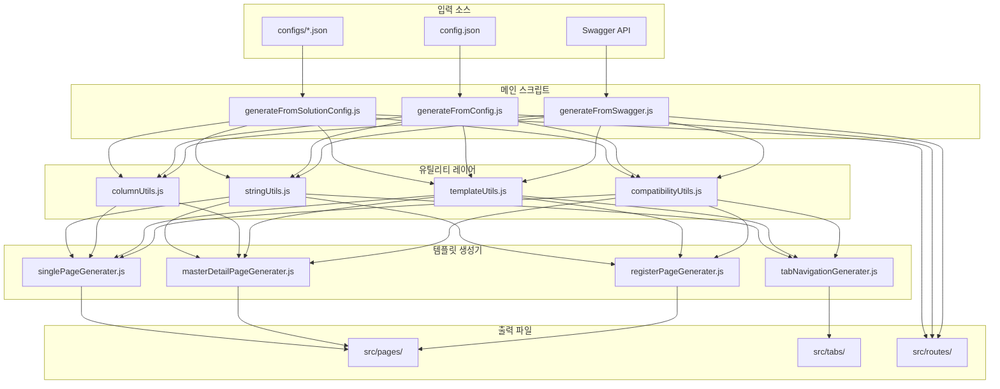
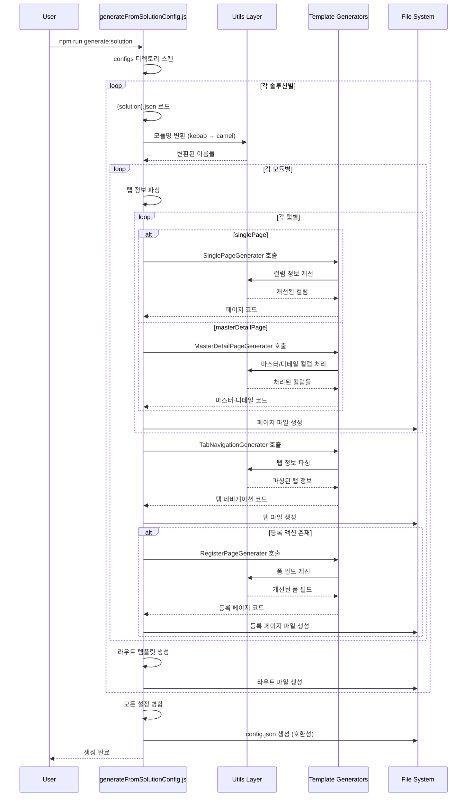
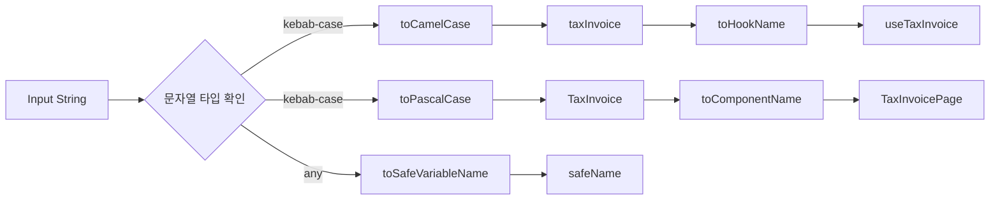
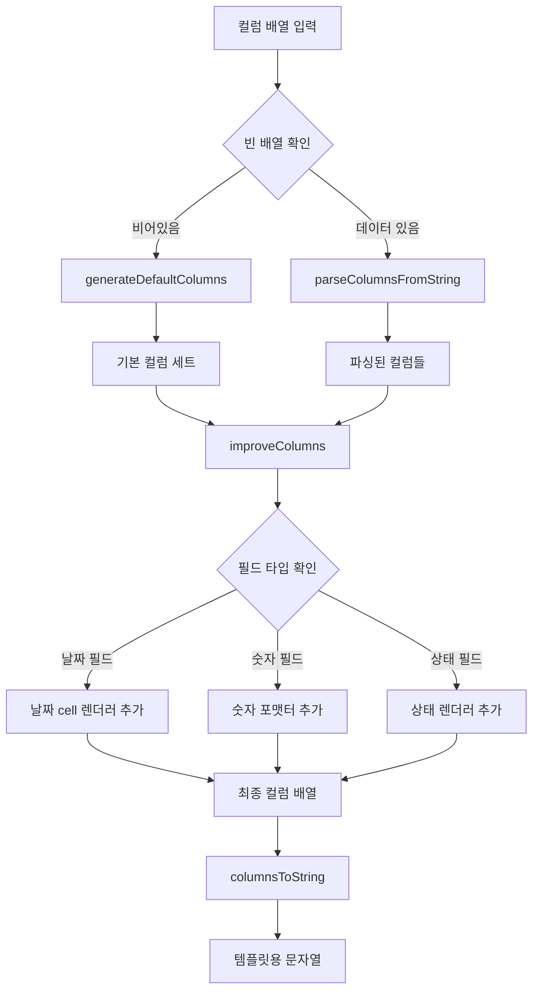
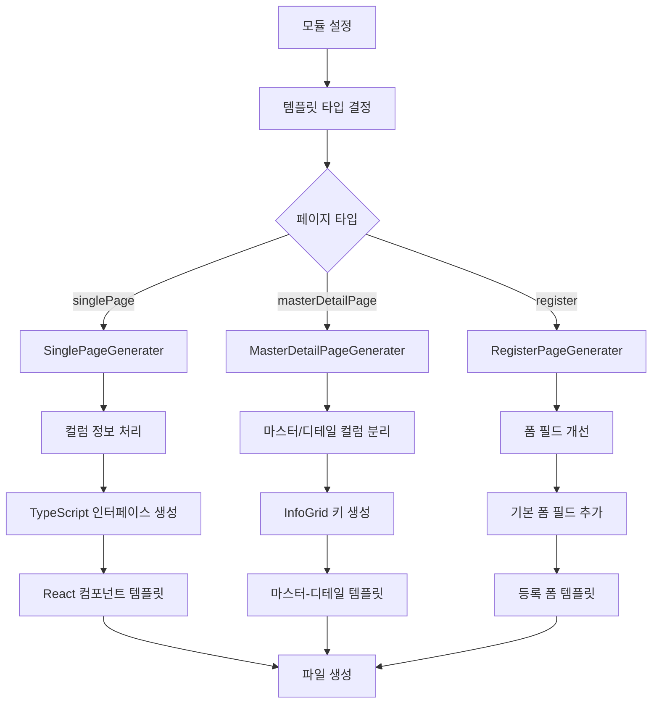
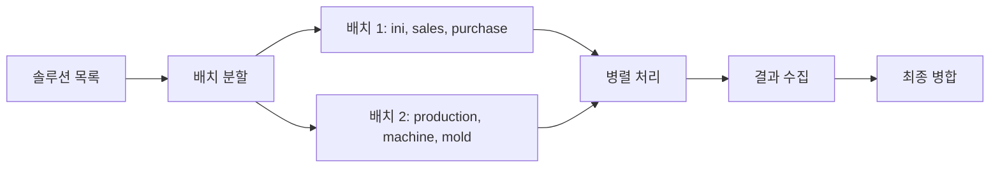
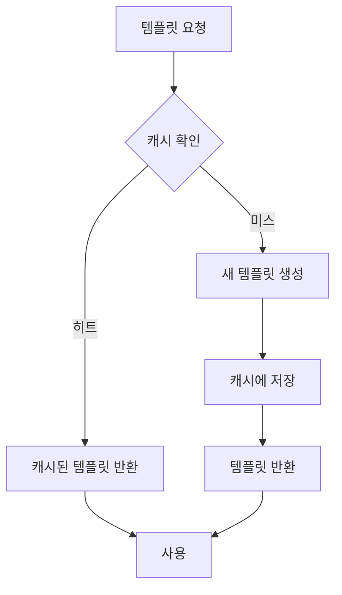

# Primes Script 아키텍처 문서

## 🏗️ 전체 아키텍처



## 🔄 솔루션별 코드 생성 흐름



## 🧩 컴포넌트별 상세 구조

### 1. StringUtils 모듈



### 2. ColumnUtils 모듈



### 3. 템플릿 생성 과정



## 🔧 에러 처리 및 복구 메커니즘

```mermaid
graph TD
    A[스크립트 실행] --> B{configs 디렉토리 존재?}
    B -->|없음| C[기본 config.json 사용]
    B -->|있음| D[솔루션별 처리]

    D --> E{솔루션 파일 로드}
    E -->|실패| F[해당 솔루션 스킵]
    E -->|성공| G[모듈 처리]

    G --> H{페이지 생성}
    H -->|실패| I[에러 로그 출력]
    H -->|성공| J[파일 저장]

    J --> K{파일 중복?}
    K -->|중복| L[자동 리네이밍 (_1, _2)]
    K -->|없음| M[정상 저장]

    F --> N[다음 솔루션 처리]
    I --> N
    L --> N
    M --> N

    N --> O{모든 솔루션 완료?}
    O -->|아니오| D
    O -->|예| P[병합된 config.json 생성]

    C --> Q[기존 방식으로 처리]
    P --> R[완료]
    Q --> R
```

## 📊 성능 최적화 전략

### 1. 병렬 처리



### 2. 템플릿 캐싱



## 🎯 확장 포인트

### 1. 새로운 템플릿 생성기 추가

```javascript
// template_generater/newTemplateGenerater.js
export const NewTemplateGenerater = (config) => {
	// 1. 설정 파싱
	// 2. 유틸리티 함수 활용
	// 3. 템플릿 문자열 생성
	// 4. 반환
};
```

### 2. 새로운 유틸리티 함수 추가

```javascript
// utils/newUtils.js
export const newUtilFunction = (input) => {
	// 새로운 유틸리티 로직
};
```

### 3. 새로운 입력 소스 지원

```javascript
// generateFromNewSource.js
import { existingUtils } from './utils/index.js';
import { existingGenerators } from './template_generater/index.js';

export const generateFromNewSource = (source) => {
	// 새로운 소스 파싱 로직
};
```

## 🔍 디버깅 가이드

### 1. 로그 레벨 설정

```bash
# 상세 로그 출력
DEBUG=true npm run generate:solution

# 특정 솔루션만 디버깅
SOLUTION=sales npm run generate:solution
```

### 2. 일반적인 문제들

| 문제                        | 원인                   | 해결책                               |
| --------------------------- | ---------------------- | ------------------------------------ |
| `masterType is not defined` | 타입 정의 누락         | masterDetailPageGenerater.js 확인    |
| `Unexpected token '.'`      | Optional chaining 사용 | compatibilityUtils.js 사용           |
| 파일 생성 실패              | 권한 또는 경로 문제    | 디렉토리 권한 확인                   |
| 하이픈 변환 안됨            | stringUtils 미적용     | 템플릿 생성기에서 유틸리티 사용 확인 |

## 🎯 Primes Standard Patterns (표준 패턴)

### Selected Row Handling Pattern (선택된 행 처리 표준)

#### ✅ **표준 방식 (권장)**

```typescript
// 1. 선택된 데이터를 저장할 state
const [selectedItemData, setSelectedItemData] = useState<ItemType | null>(null);

// 2. selectedRows 변경 감지 (인덱스 기반 접근)
useEffect(() => {
  console.log('selectedRows', selectedRows);
  if (selectedRows.size > 0) {
    const selectedRowIndex = Array.from(selectedRows)[0];
    const rowIndex: number = parseInt(selectedRowIndex);
    const selectedItem: ItemType = data[rowIndex];

    setSelectedItemData(selectedItem || null);
  } else {
    setSelectedItemData(null);
  }
}, [selectedRows, data]);

// 3. 핸들러에서 간단한 검증
const handleEdit = () => {
  console.log('selectedItemData', selectedItemData);
  if (!selectedItemData) {
    toast.warning('수정할 항목을 선택해주세요.');
    return;
  }
  setShowEditModal(true);
};

// 4. DatatableComponent 설정
<DatatableComponent
  enableSingleSelect={true}  // 단일 선택만 허용
  selectedRows={selectedRows}
  toggleRowSelection={toggleRowSelection}
  // ...
/>

// 5. 모달에 데이터 전달
<DraggableDialog
  open={showEditModal}
  content={
    <RegisterComponent
      mode="update"
      selectedItem={selectedItemData}
      onClose={() => setShowEditModal(false)}
    />
  }
/>
```

#### ❌ **비표준 방식 (지양)**

```typescript
// ID로 찾기 - 복잡하고 비효율적
const selectedRowId = Array.from(selectedRows)[0];
const selectedItem = data.find(item => item.id.toString() === selectedRowId);

// 매번 함수로 검색 - 불필요한 연산
const getSelectedItem = () => {
  return data.find(/* ... */);
};

// 별도 state 없이 매번 계산
{selectedRows.size > 0 && <Modal selectedItem={getSelectedItem()} />}
```

#### 🎯 **패턴의 장점**

- **🚀 성능**: 인덱스 직접 접근 (O(1))
- **🔄 일관성**: 모든 리스트 페이지에서 동일한 패턴
- **🐛 디버깅**: 로그로 쉽게 추적 가능
- **🧹 간소화**: 복잡한 검색 로직 불필요
- **⚡ 실시간**: selectedRows 변경 시 즉시 반영

이 아키텍처 문서는 시스템의 전체적인 구조와 동작 방식을 이해하는 데 도움이 됩니다.
