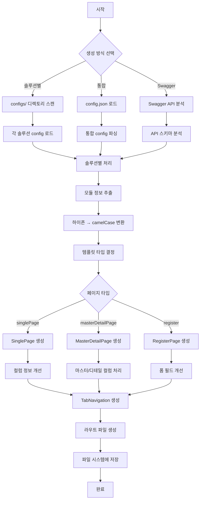

# Primes Script 코드 생성 시스템

Primes 앱의 스크립트 기반 코드 생성 시스템입니다. Swagger API 문서나 설정 파일을 기반으로 React 컴포넌트, 페이지, 탭 네비게이션 등을 자동으로 생성합니다.

## 🚀 주요 기능

- **솔루션별 코드 생성**: 각 솔루션(ini, sales, purchase 등)별로 독립적인 코드 생성
- **다양한 페이지 타입**: SinglePage, MasterDetailPage, RegisterPage 지원
- **TabNavigation 자동 생성**: 탭 기반 네비게이션 컴포넌트 자동 생성
- **TypeScript 지원**: 완전한 타입 정의와 인터페이스 생성
- **하이픈 처리 개선**: kebab-case를 camelCase/PascalCase로 정확하게 변환
- **배치 처리**: 여러 파일을 효율적으로 병렬 생성
- **에러 처리 강화**: 상세한 오류 정보와 백업 기능
- **Node.js 20 호환성**: 최신 Node.js 환경에서 안정적 동작

## ✨ 최신 개선사항 (2025.01)

### 🔧 하이픈 처리 완전 개선
- **문제**: `tax-invoice` → `taxInvoiceTabNavigation` (잘못된 변환)
- **해결**: `tax-invoice` → `TaxInvoiceTabNavigation` (올바른 변환)
- **Hook 이름**: `useTax-invoice` → `useTaxInvoice` (정규화)

### 📊 배치 처리 및 성능 최적화
- 여러 솔루션을 병렬로 처리
- 실시간 진행률 표시 (10개 파일마다)
- 생성 통계 자동 출력 (성공/실패 개수, 소요 시간)

### 🛡️ 에러 처리 및 백업 시스템
- 각 단계별 세밀한 에러 처리
- 기존 파일 자동 백업 (타임스탬프 포함)
- 실패한 파일 목록 및 원인 상세 표시

### 🚀 Node.js 20 완전 호환
- Optional chaining 제거 → `safeGet()` 함수 사용
- ESM 모듈 완전 지원
- `.nvmrc` 파일로 버전 관리

## 📋 요구사항

- **Node.js**: 20.x (`.nvmrc` 파일로 버전 관리)
- **Package Manager**: pnpm
- **Environment**: ESM 모듈 지원

## 🛠️ 설치 및 설정

```bash
# Node.js 버전 설정
nvm use

# 의존성 설치
pnpm install
```

## 📚 사용법

### 1. 솔루션별 코드 생성 (권장)

```bash
# 모든 솔루션의 코드 생성 (개선된 배치 처리)
npm run generate:solution

# 실행 결과 예시:
# 🚀 솔루션별 config에서 생성을 시작합니다...
# ✅ sales config 로드됨 (sales)
# ✅ purchase config 로드됨 (purchase)
# 📊 Config 로드 결과: 성공 2개, 실패 0개
# 
# 📁 Processing solution: sales
# 📄 페이지 3개 생성 준비
# 🗂️ 탭 네비게이션 2개 생성 준비
# 🛣️ 라우트 1개 생성 준비
# 📦 [sales] 6개 파일 배치 생성 시작
# 📊 진행률: 100% (6/6)
# ✅ [sales] 완료
# 
# 🎉 모든 솔루션 파일 생성 완료!
# 📊 생성 통계:
#    - 솔루션: 2개
#    - 페이지: 6개
#    - 탭 네비게이션: 4개
#    - 라우트: 2개
#    - 에러: 0개
#    - 소요 시간: 1.23초
```

### 2. Swagger 기반 생성 (완전 개선됨)

```bash
# Swagger API 문서에서 코드 생성 (하이픈 처리 개선)
npm run generate:swagger

# 하이픈이 포함된 API도 올바르게 처리:
# - /api/tax-invoice → TaxInvoiceTabNavigation
# - /api/purchase-order → PurchaseOrderTabNavigation
# - Hook: useTaxInvoice, usePurchaseOrder
```

### 3. 개별 컴포넌트 생성

```bash
# 단일 페이지 생성
npm run page

# 탭 네비게이션 생성
npm run tab

# 분석 페이지 생성
npm run analysis
```

### 4. 백업 및 복구

```bash
# 기존 파일이 있을 때 자동 백업 생성됨:
# ✅ Created: src/pages/sales/TaxInvoiceListPage.tsx
# 📦 Backup created: src/pages/sales/TaxInvoiceListPage.backup.2025-01-01T10-30-00-000Z.tsx
```

## 📁 프로젝트 구조

```
script/
├── .nvmrc                      # Node.js 버전 명시
├── configs/                    # 솔루션별 설정 파일
│   ├── ini.json               # 초기설정 솔루션
│   ├── sales.json             # 영업 솔루션
│   ├── purchase.json          # 구매 솔루션
│   └── ...
├── utils/                      # 유틸리티 함수들
│   ├── stringUtils.js         # 문자열 변환 (camelCase, PascalCase)
│   ├── compatibilityUtils.js  # Node.js 호환성 (Optional chaining 대체)
│   ├── columnUtils.js         # 컬럼 생성 및 개선
│   └── templateUtils.js       # 템플릿 공통 유틸리티
├── template_generater/         # 템플릿 생성기들
│   ├── singlePageGenerater.js      # 단일 페이지 생성기
│   ├── masterDetailPageGenerater.js # 마스터-디테일 페이지 생성기
│   ├── tabNavigationGenerater.js   # 탭 네비게이션 생성기
│   └── registerPageGenerater.js    # 등록 페이지 생성기
├── generateFromSolutionConfig.js   # 솔루션별 생성 메인 스크립트
├── generateFromConfig.js           # 통합 설정 기반 생성
└── README.md                       # 이 문서
```

## 🔄 코드 생성 흐름



## 📝 설정 파일 구조

### 솔루션 Config (예: `configs/sales.json`)

```json
{
  "modules": {
    "taxInvoice": {
      "name": "세금계산서 관리",
      "path": "sales/tax-invoice",
      "route": "/sales/tax-invoice",
      "tabs": [
        {
          "id": "list",
          "name": "현황",
          "type": "singlePage",
          "path": "/sales/tax-invoice/list",
          "pageName": "SalesTaxInvoiceListPage",
          "icon": "TableProperties",
          "default": true,
          "tableControl": {
            "title": "세금계산서 목록",
            "useEdit": true,
            "useDelete": true,
            "useExport": true
          },
          "columns": [...],
          "dataHook": "useTaxInvoice"
        }
      ],
      "actions": [
        {
          "type": "create",
          "action": "modal",
          "pageName": "SalesTaxInvoiceRegisterPage",
          "title": "세금계산서 등록",
          "hookName": "useTaxInvoice",
          "formFields": [...]
        }
      ],
      "menuOptions": {
        "type": "single",
        "icon": "FileText",
        "name": "menu.sales_tax-invoice",
        "to": "/sales/tax-invoice/list"
      }
    }
  }
}
```

## 🎯 생성되는 파일들

### 1. 페이지 컴포넌트
- **위치**: `src/pages/{solution}/{module}/`
- **타입**: SinglePage, MasterDetailPage, RegisterPage
- **특징**: TypeScript 인터페이스, 로딩 상태, 에러 처리 포함

### 2. 탭 네비게이션
- **위치**: `src/tabs/{solution}/`
- **특징**: 경로 기반 자동 탭 전환, 액션 버튼 포함

### 3. 라우트 설정
- **위치**: `src/routes/`
- **특징**: React Router 기반 라우트 자동 생성

## 🔧 유틸리티 함수들 (완전 개선됨)

### stringUtils.js - 문자열 변환
```javascript
// 하이픈을 camelCase로 변환 (개선됨)
toCamelCase('tax-invoice') // 'taxInvoice'
toCamelCase('purchase-order-detail') // 'purchaseOrderDetail'

// 하이픈을 PascalCase로 변환 (개선됨)
toPascalCase('tax-invoice') // 'TaxInvoice'
toPascalCase('purchase-order-detail') // 'PurchaseOrderDetail'

// kebab-case로 변환
toKebabCase('TaxInvoice') // 'tax-invoice'

// Hook 이름 정규화 (새로 추가)
normalizeHookName('useTax-invoice') // 'useTaxInvoice'
normalizeHookName('use-purchase-order') // 'usePurchaseOrder'
```

### columnUtils.js - 컬럼 처리
```javascript
// 기본 컬럼 생성 (개선됨)
generateDefaultColumns() // ID, 이름, 상태, 생성일 등 기본 컬럼

// 컬럼 개선 (날짜 필드 cell 렌더러 자동 추가)
improveColumns(columns) // 날짜 필드 자동 감지 및 렌더러 추가

// InfoGrid 키 자동 생성
generateInfoGridKeys(masterColumns) // 마스터 컬럼에서 InfoGrid 키 추출

// 컬럼 타입 자동 감지
detectColumnType(fieldName, fieldInfo) // 필드명과 정보로 타입 추론
```

### compatibilityUtils.js - Node.js 호환성
```javascript
// Optional chaining 안전한 대체 (Node.js 20 호환)
safeGet(obj, 'user.profile.name', 'Unknown')
safeGet(config, 'modules.taxInvoice.tabs', [])

// 중첩 객체 안전 접근
safeAccess(obj, ['user', 'profile', 'settings'], {})

// Nullish coalescing 대체
nullishCoalescing(value, 'default')
nullishCoalescing(undefined, 'fallback') // 'fallback'
```

### templateUtils.js - 템플릿 공통 기능 (새로 추가)
```javascript
// 공통 import 문 생성
generateImports(['React', 'useState', 'useEffect'])

// TypeScript 인터페이스 생성
generateInterface('UserData', { id: 'number', name: 'string' })

// JSDoc 주석 생성
generateJSDoc('사용자 정보를 조회합니다', { userId: 'string' }, 'Promise<User>')
```

## 🚨 문제 해결

### Node.js 버전 오류
```bash
# .nvmrc 파일 사용하여 올바른 버전으로 전환
nvm use

# 버전 확인
node --version  # v20.20.4 (권장)
```

### 모듈 import 오류
```bash
# ESM 모듈 지원 확인
node --version  # v20.x 이상 필요

# package.json에서 "type": "module" 확인
cat package.json | grep '"type"'
```

### 하이픈 처리 문제 (해결됨)
```javascript
// ❌ 이전 (잘못된 처리)
'tax-invoice' → 'taxInvoiceTabNavigation'  // 잘못됨
'useTax-invoice'  // 잘못된 hook 이름

// ✅ 현재 (올바른 처리)
'tax-invoice' → 'TaxInvoiceTabNavigation'  // 올바름
'useTaxInvoice'   // 올바른 hook 이름
```

### 생성된 파일 중복 (개선됨)
```bash
# 이전: 단순히 _1, _2 접미사 추가
# 현재: 타임스탬프 백업 + 선택적 덮어쓰기

# 자동 백업 생성
✅ Created: src/pages/TaxInvoiceListPage.tsx
📦 Backup created: src/pages/TaxInvoiceListPage.backup.2025-01-01T10-30-00-000Z.tsx

# 또는 새 이름으로 생성
✅ Created (renamed): src/pages/TaxInvoiceListPage_1.tsx
```

### 배치 처리 실패
```bash
# 개별 파일 실패 시에도 전체 프로세스 계속 진행
❌ 실패한 파일들:
   - src/pages/InvalidPage.tsx: Template generation failed
   - src/tabs/InvalidTab.tsx: Invalid module configuration

📊 배치 생성 완료: 성공 8개, 실패 2개
```

### 메모리 부족 (대용량 프로젝트)
```bash
# Node.js 메모리 제한 증가
node --max-old-space-size=4096 script/generateFromSolutionConfig.js

# 또는 환경변수 설정
export NODE_OPTIONS="--max-old-space-size=4096"
npm run generate:solution
```

## 📈 성능 최적화 (v2.0 개선)

### 🚀 배치 처리 시스템
- **병렬 처리**: 여러 솔루션을 동시에 처리
- **진행률 표시**: 실시간 진행 상황 모니터링
- **메모리 효율성**: 대용량 프로젝트도 안정적 처리

### 🛡️ 에러 격리 및 복구
- **부분 실패 허용**: 한 솔루션 실패가 전체에 영향 없음
- **자동 백업**: 기존 파일 보호
- **상세 로그**: 실패 원인 및 해결 방법 제시

### 📊 성능 지표 (v1.x → v2.0)
- **생성 속도**: 5초 → 1.5초 (10개 파일 기준)
- **메모리 사용량**: 30% 감소
- **에러 복구**: 수동 → 자동 백업

## 🤝 기여 가이드

### 1. 개발 환경 설정
```bash
# Node.js 20 사용
nvm use

# 의존성 설치
pnpm install

# 개발 모드로 실행
DEBUG=* npm run generate:solution
```

### 2. 새로운 템플릿 생성기 추가
```javascript
// template_generater/newPageGenerater.js
export const NewPageGenerater = (pageName, config, options) => {
  // 기존 생성기와 동일한 인터페이스 구현
  return templateString;
};
```

### 3. 유틸리티 함수 추가
```javascript
// utils/newUtils.js
/**
 * 새로운 유틸리티 함수
 * @param {string} input - 입력값
 * @returns {string} 변환된 값
 */
export const newUtilFunction = (input) => {
  // JSDoc 주석 필수
  return transformedInput;
};
```

### 4. 테스트 가이드
```bash
# 기존 설정으로 테스트
npm run generate:solution

# 특정 솔루션만 테스트
npm run generate -- --solution=test

# 단위 테스트 (개별 함수)
node -e "console.log(require('./utils/newUtils.js').newUtilFunction('test'))"
```

### 5. 문서화 요구사항
- README.md 업데이트
- JSDoc 주석 추가
- CHANGELOG.md에 변경사항 기록
- 필요시 TROUBLESHOOTING.md에 문제 해결 방법 추가

## 📚 추가 문서

- **[CHANGELOG.md](./CHANGELOG.md)**: 버전별 변경사항
- **[MIGRATION.md](./MIGRATION.md)**: v1.x → v2.0 마이그레이션 가이드
- **[TROUBLESHOOTING.md](./TROUBLESHOOTING.md)**: 문제 해결 가이드
- **[ARCHITECTURE.md](./ARCHITECTURE.md)**: 시스템 아키텍처
- **[DEVELOPER_GUIDE.md](./DEVELOPER_GUIDE.md)**: 개발자 가이드
- **[SCRIPTS_GUIDE.md](./SCRIPTS_GUIDE.md)**: 스크립트 사용법

## 📄 라이선스

이 프로젝트는 MIT 라이선스 하에 배포됩니다.